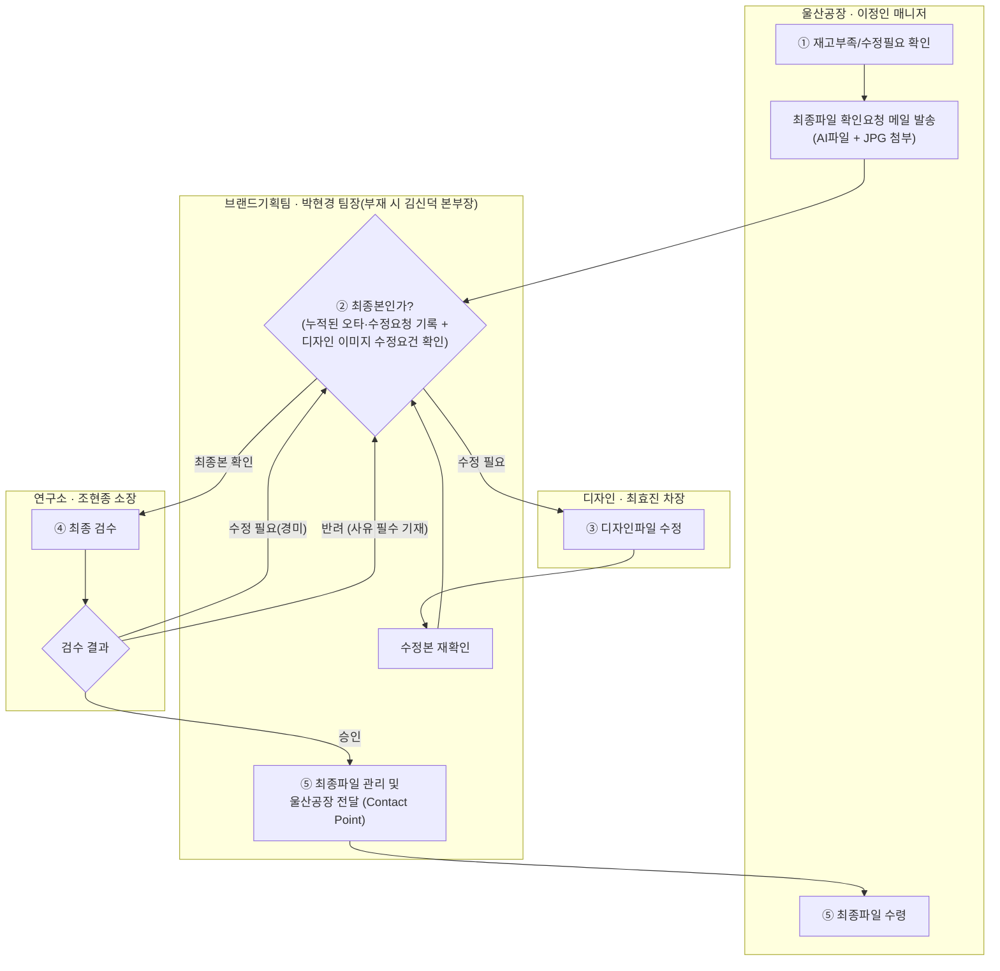

# 포장지 재발주 프로세스 정리 (AS-IS)

작성일: 2026-07-22
범위: 기존 제품 포장지의 **재발주 처리** 프로세스 (신규 디자인 건 제외)

---

## 1. 개요

| 항목 | 내용 |
|---|---|
| 포장재 유형 | ① 병제품 부착 라벨, ② PP재질 포대 포장재 |
| 대상 제품 | 비료 제품, 작물보호제 |
| 처리 파일 | 어도비 일러스트레이터(AI) 원본 + JPG 확인용, 건당 2개 |
| 처리 물량 | 월 20건 이상 |
| 현재 소통 방식 | 전원 이메일 (PPT/메일 첨부) |
| 관련 인원 | 4명 이상 (공장/브랜드기획팀/디자인/연구소, 부서 간 협업) |

## 2. 역할 및 담당자

| 역할 | 담당자 | 소속 | 책임 |
|---|---|---|---|
| 요청자 | 이정인 매니저 | 울산공장 | 재고부족/수정필요 감지, 재발주 트리거, 박현경 팀장으로부터 최종파일 수령 |
| 1차 검토·승인 · **최종파일 관리 창구** | 박현경 팀장 (부재 시 김신덕 본부장) | 브랜드기획팀 | 파일 최종본 여부 판단, 수정요청 또는 연구소 이관 결정. **최종 승인파일의 관리 및 울산공장 전달을 담당하는 단일 접점(Single Point of Contact)** |
| 디자인 수정 | 최효진 차장 | 디자인 | 지적사항에 따른 디자인파일 수정 |
| 최종 검수·승인 · **반려 판단권** | 조현종 소장 | 연구소 | 표시사항/법적요건 등 최종 검수 및 승인. **반려 여부는 연구소 단독 판단**(반려 시 사유 필수 기재) |

## 3. 트리거 조건

울산공장에서 아래 중 하나가 발생하면 재발주 프로세스가 시작된다.

- 포장지 재고 소진(임박)
- 기존 포장지에 수정이 필요한 경우 (표시사항 변경 등)

## 4. 표준 프로세스 흐름

## 5. 단계별 상세

| 단계 | 담당 | 내용 | 수단 |
|---|---|---|---|
| 1 | 이정인 매니저 → 박현경 팀장 | 재발주 전 보유 중인 포장지 인쇄파일(AI+JPG)이 최종파일인지 체크 요청 | 이메일 |
| 2 | 박현경 팀장 | 파일 검토 후 분기 판단 — 수정 필요 시 최효진 차장에게 수정 요청 / 불필요 시 조현종 소장에게 최종 검수 요청. **판단 기준**: ① 그간 다른 채널(구두·메신저 등)로 접수돼 별도로 기록해둔 오타·수정요청 사항 반영 여부, ② 디자인적으로 이미지 수정이 필요한 부분 존재 여부 | PPT 또는 이메일 |
| 3 | 최효진 차장 → 박현경 팀장 | 디자인파일 수정 후 확인 메일 발송 → 박현경 팀장 재확인 → 문제없으면 연구소로 이관 | 이메일 |
| 4 | 조현종 소장 → 박현경 팀장 | 최종 검수 후 결과 통보. 결과는 3가지 — **승인** / **수정 필요**(경미한 보완, 2단계로 회귀) / **반려**(부적합 판정, **반려사유를 반드시 기재**하여 2단계로 회귀). **반려 여부는 연구소(조현종 소장) 단독 판단** — 박현경 팀장과 협의 절차 없음 | 이메일 |
| 5 | 박현경 팀장 → 이정인 매니저 | 승인된 최종파일을 관리하고, **울산공장 전달 창구(Contact Point)**로서 요청자에게 전달 | 이메일 |

## 6. 예외 처리 규칙

1. **승인권자 부재 대응** — 박현경 팀장 공석 시 김신덕 본부장이 서브 담당자로서 프로세스 확인 및 승인검토 역할을 동일하게 수행 가능.
2. **최근 수정 파일 예외 승인** — 최근 3개월 이내 수정 이력이 있는 파일은 최신 상태로 간주, 연구소 최종 승인이 없어도 박현경 팀장 승인만으로 울산공장에서 인쇄 진행 가능.

## 7. 현재 프로세스의 문제점

| 문제 | 영향 |
|---|---|
| 전 과정이 이메일 기반 | 월 20건 이상 처리 시 메일 작성·추적 자체가 업무 부담 |
| 건별 이력 누락 | A·B·C 포장재 등 여러 건이 동시에 진행될 때, 담당자가 건별로 개별 답신하지 않고 여러 건의 진행상황을 한 메일에 묶어서 회신하는 경우가 많아 특정 건의 이력이 누락되거나 추적이 어려움 |
| 파일 변경사항 비가시화 | 무엇이 바뀌었는지 파악 불가 → 검토 효율 저하 |
| 최종파일 식별 불가 | 어떤 버전이 최신/승인본인지 파일만으로 판단 어려움 |
| 수정요청 이력 부재 | 어느 부서가 언제 무엇을 수정 요청했는지 추적 불가 |
| 제품 기준 관리 부재 | 제품명 단위로 포장지 파일이 정리되어 있지 않음 |

## 8. 개선 방향 (다음 단계 요구사항 초안)

- 이메일 대신 **시스템 내 요청 단위 워크플로우**로 전환 (요청 → 1차검토 → 수정 → 최종검수 → 완료, 상태값 관리)
- **제품명 기준**으로 포장재(라벨/PP포대) 파일 그룹핑 및 관리
- 파일 업로드 시 **버전 자동관리 + 변경 이력**(요청자/부서/요청내용/일시) 기록
- **최종 승인 파일 자동 식별·잠금** (버전 혼동 방지)
- 3개월 이내 승인 예외 규칙을 시스템 로직으로 반영
- 담당자 부재 시 서브 담당자 자동 라우팅(박현경 팀장 ↔ 김신덕 본부장)
- 동일 제품·동일 기간 **중복 재발주 건 감지** 알림
- **건(포장재) 단위로 진행상황·이력을 분리 관리** — 여러 건을 한 메일에 묶어 답하다 특정 건의 이력이 누락되는 문제 방지
- 오타·수정요청을 접수 즉시 해당 건에 **누적 기록**(어느 채널로, 언제, 무엇을 요청했는지)해 재발주 시 자동 반영
- **반려 시 사유 입력을 필수값**으로 강제, 반려 이력도 건별로 보존
- **박현경 팀장을 최종 승인파일의 시스템상 관리 주체(Owner)**로 지정 — 승인 파일 저장소 및 울산공장 전달 창구 역할을 시스템이 대신 수행
- **반려 처리 권한을 연구소(조현종 소장) 역할로 제한** — 시스템상 반려 액션은 연구소 계정만 실행 가능하도록 권한 분리
